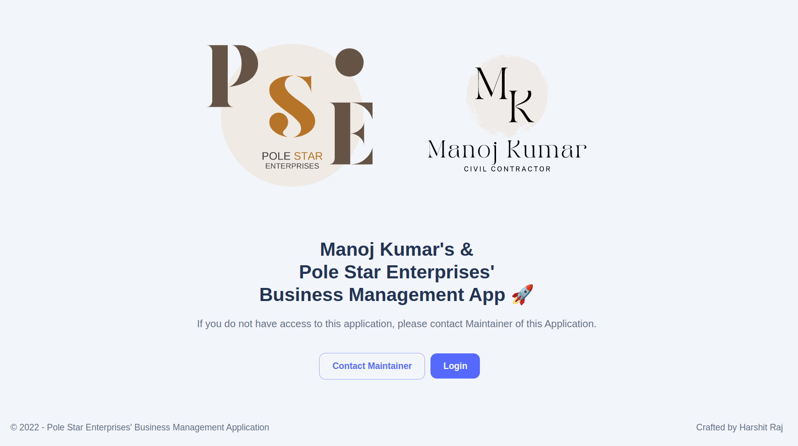
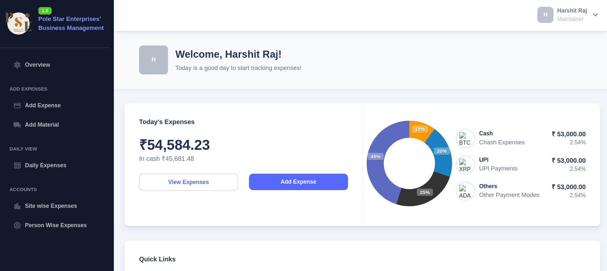

# Business Management App

Customized for **Pole Star Enterprises**. This is a simple app that helps Pole Star Enterprise manage business. It's a simple CRUD app that allows PSE to manage sites, material, and payments. It also has a simple dashboard that shows all relevant details.

## Tech Stack

- Next.js
- MUI (Material UI)
- MongoDB
- Iron Session

## Hosting

- AWS EC2
- Custom Domain

## App



## Admin side



## Local Setup

First, run the development server:

```bash
yarn # to install dependencies
yarn dev
```

Open [http://localhost:3000](http://localhost:3000) with your browser to see the result.

## Footnotes

- Codebase is simple and easy to modify for any usage.
- For the first time I've worked on frontend project. Still, results are good.

## Author

- [Vedant Dangi](https://vedantdangi.me)
